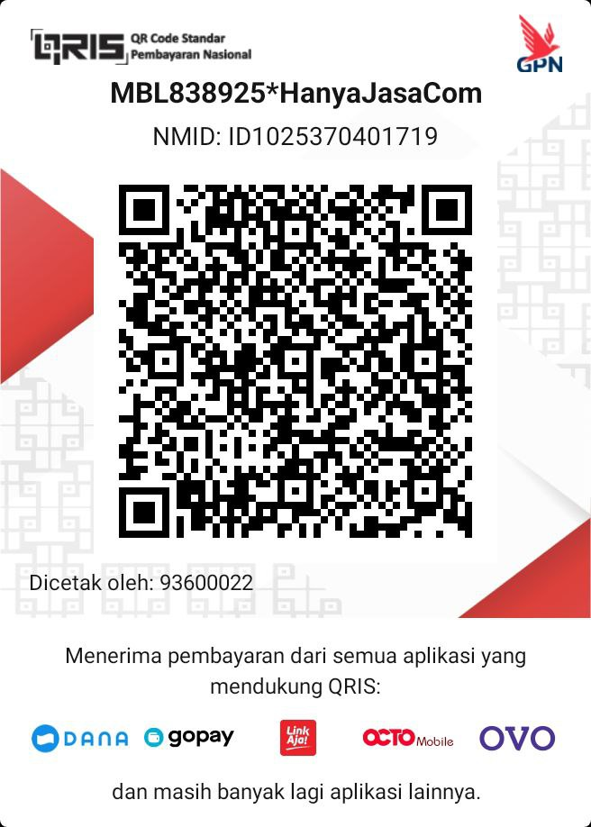

# Kalender 2026 - Android

Aplikasi kalender Gregorian tahun 2026 yang dirancang khusus untuk pengguna Indonesia, menampilkan hari libur nasional dengan warna merah beserta keterangannya.

## Fitur

- **Tampilan 12 Bulan Sekaligus** — Semua bulan ditampilkan dalam satu halaman scroll vertikal
- **Toggle Mode Tampilan** — Tombol di toolbar untuk beralih antara:
  - *Mode Accordion* — buka/tutup satu bulan sekaligus dengan klik nama bulan
  - *Mode Semua Terbuka* — semua 12 bulan terbuka sekaligus
- **Hari Libur dari File CSV** — Data hari libur dimuat dari `assets/holidays.csv`, tidak perlu update kode untuk mengubah data libur
- **Keterangan Hari Libur** — Daftar tanggal merah beserta nama hari liburnya ditampilkan di bawah setiap bulan
- **Indikator Warna Tanggal:**
  - Hari Libur Nasional — Merah tebal dengan latar lingkaran merah muda
  - Hari Minggu — Merah
  - Hari Sabtu — Biru
  - Hari Biasa — Hitam

## Hari Libur Nasional 2026

Data diambil dari file `assets/holidays.csv`. Format file:

```
tanggal,keterangan
YYYY-MM-DD,Nama Hari Libur
```

| Bulan | Tanggal | Keterangan |
|-------|---------|------------|
| Januari | 1 | Tahun Baru 2026 |
| Januari | 16 | Isra Mikraj Nabi Muhammad SAW |
| Februari | 17 | Tahun Baru Imlek 2577 |
| Maret | 19 | Hari Suci Nyepi |
| Maret | 20 | Idul Fitri 1447 H |
| Maret | 21 | Idul Fitri 1447 H |
| April | 3 | Wafat Yesus Kristus |
| April | 5 | Hari Paskah |
| Mei | 1 | Hari Buruh Internasional |
| Mei | 12 | Hari Raya Waisak 2570 |
| Mei | 14 | Kenaikan Yesus Kristus |
| Mei | 27 | Idul Adha 1447 H |
| Juni | 1 | Hari Lahir Pancasila |
| Juni | 16 | Tahun Baru Islam 1448 H |
| Agustus | 17 | Hari Kemerdekaan RI |
| Agustus | 25 | Maulid Nabi Muhammad SAW |
| Desember | 25 | Hari Raya Natal |

> Untuk menambah atau mengubah hari libur, cukup edit file `assets/holidays.csv` tanpa perlu mengubah kode program.

## Teknologi

- **Bahasa:** Kotlin
- **Min SDK:** 33 (Android 13)
- **Target SDK:** 36
- **UI:** RecyclerView dengan GridLayoutManager (7 kolom)
- **Library:** AndroidX, Material Design 3

## Struktur Proyek

```
app/src/main/
├── assets/
│   └── holidays.csv            # Data hari libur nasional (format CSV)
├── java/com/hanyajasa/kalender2026/
│   ├── MainActivity.kt         # Aktivitas utama, baca CSV, bangun data bulan
│   ├── MonthAdapter.kt         # Adapter bulan: accordion & expand-all, legend libur
│   └── DayAdapter.kt           # Adapter grid tanggal, pewarnaan hari
└── res/
    ├── layout/
    │   ├── activity_main.xml   # Layout utama (Toolbar + RecyclerView)
    │   ├── item_month.xml      # Item bulan: header + grid + legend
    │   └── item_day.xml        # Item sel tanggal
    ├── menu/
    │   └── menu_main.xml       # Menu toolbar (Toggle tampilan + Tentang)
    └── drawable/
        └── bg_holiday.xml      # Background lingkaran merah muda untuk hari libur
```

## Instalasi

1. Unduh APK dari folder `app/build/outputs/apk/debug/`
2. Instal pada perangkat Android 13 ke atas
3. Buka aplikasi

## Build APK

```bash
./gradlew assembleDebug
```

APK akan dihasilkan di: `app/build/outputs/apk/debug/app-debug.apk`

## Lisensi

Proyek ini dilisensikan di bawah [MIT License](LICENSE).

## Dukungan

Jika Anda ingin mendukung pengembangan proyek opensource ini, Anda bisa berdonasi melalui:

### Donasi Pengembangan

Jika ingin mendukung pengembangan aplikasi ini, atau merasa aplikasi ini bermanfaat, Anda dapat melakukan donasi melalui transfer QRIS dengan scan gambar berikut:



Scan QR code pada gambar `QRISHanyaJasaCom.jpg` di folder proyek.

### Rekening Bank

| Bank | Nomor Rekening |
|------|----------------|
| BSI | 9692999170 |
| BCA | 8600432053 |
| BRI | 4543-01-020754-53-0 |
| Mandiri | 159-00-0068323-4 |
| Muamalat | 6310042068 |
| Dana | 082254205110 |
| Jenius | 90110062490 |
| Jago | 101396991206 |
| Seabank | 901899706783 |

Terima kasih atas dukungan Anda!
